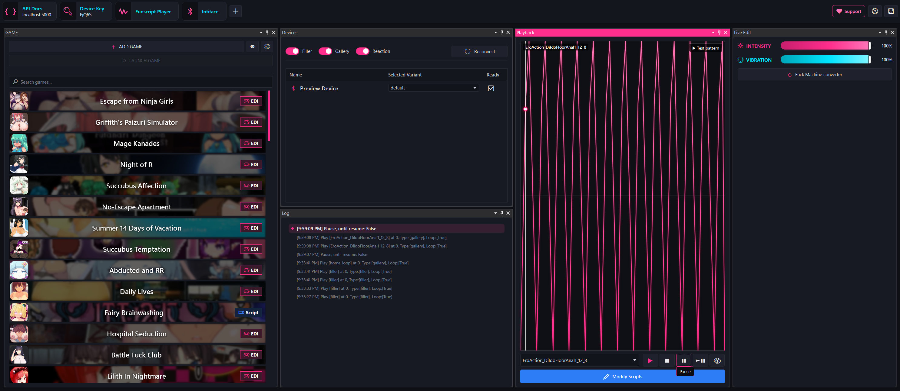
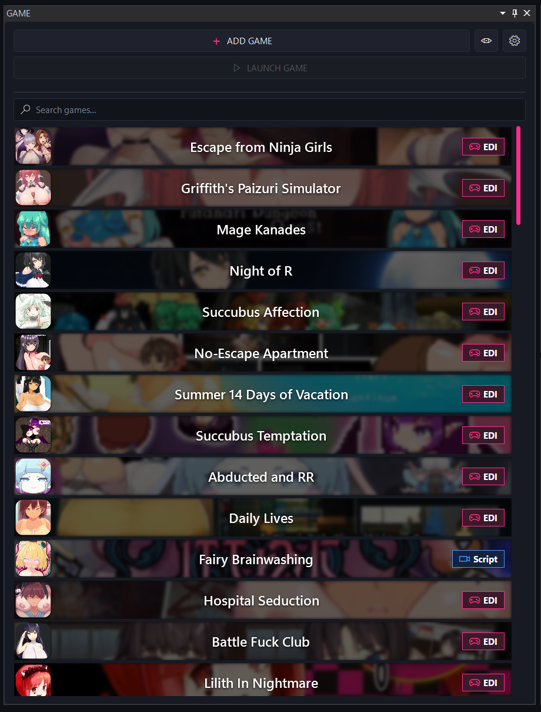
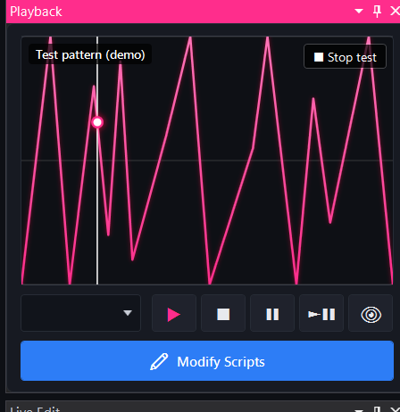
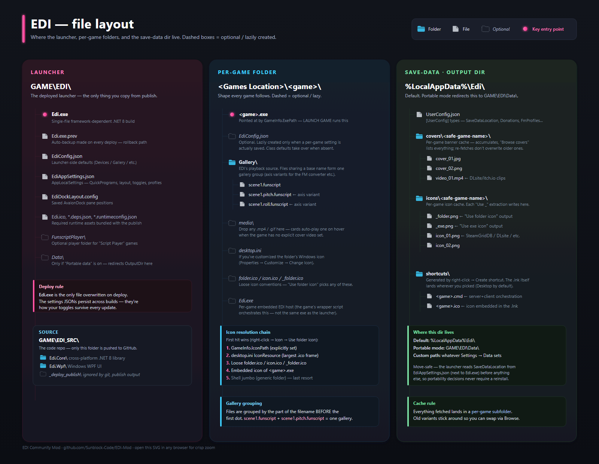

# EDI — Community Mod

> An unofficial, community-made build of **EDI (Easy Device Integration)** — a Windows app that syncs game events with interactive devices over a local REST API.
>
> **Based on [EDI by NoGRo](https://github.com/NoGRo/Edi).** This is a fan modification and is **not** affiliated with or endorsed by the original author. Please star and support the original project too.

---

## What this mod adds

This build keeps EDI's core engine and REST API intact and focuses on a reworked desktop launcher plus quality-of-life features:

- **Redesigned game launcher** — cover-art game cards with adjustable size, corners, blur, badges, and title layout, plus a clear *selected game* highlight (glow / border / bar / solid styles).
- **Cover & banner search** — pull artwork from multiple online sources (including SteamGridDB and itch.io), choose from multiple matches, and crop to fit. Animated GIF and MP4 covers play on hover/select.
- **Live funscript preview** — a built-in visualizer shows the currently playing script in real time, freezes the line on pause, and reflects live intensity/vibration. Works without hardware via an optional Preview Device.
- **Settings overhaul** — inline info popups, a top header bar with customizable quick-launch chips, persistent window size/position, and a **Dev** tab to toggle the Preview Device.
- **Device robustness fixes** — EDI no longer exits when Intiface/Buttplug isn't running (fast TCP reachability probe + widened error handling), plus Handy / OSR / preview fixes.
- **Support popup** — credits the original project and provides optional donation links.

For the full description of EDI's engine, gallery system, variants, multi-axis / multi-channel support, and the complete HTTP API, see **[README.upstream.md](README.upstream.md)** — the original project's documentation, preserved here.

---

## Screenshots

**Full interface**



**Cover-art game library**



**Live funscript preview**



---

## File layout

How the launcher, per-game folders, and the save-data dir relate. Click for full size, or grab [`docs/file-layout.svg`](docs/file-layout.svg) for crisp zoom-anywhere.



Quick rules baked into the diagram:

- **`EdiConfig.json` is optional per game** — class defaults take over when absent; the file is lazily created only when a per-game setting actually saves.
- **Gallery grouping** — files sharing a base name (e.g. `scene1.funscript` + `scene1.pitch.funscript`) form one gallery; the FM converter and multi-axis playback both treat them as a unit.
- **Icon resolution chain** — first hit wins: `IconPath` → `desktop.ini` IconResource → loose `folder.ico` / `icon.ico` / `_folder.ico` → `.exe` embedded icon → shell jumbo (generic) as last resort.
- **Per-game cache subfolders** — every download lands in `<OutputDir>\{covers|icons}\<safe-name>\` so re-fetches accumulate variants and Browse pickers can list every one.
- **Portable mode** — flips `<OutputDir>` to `GAME\EDI\Data\` so the whole launcher + its save data can travel on a USB stick.

---

## Requirements

- **Windows 10/11 (x64)**
- **.NET 8 Desktop Runtime** *and* **ASP.NET Core 8 Runtime** — download both (x64) from <https://dotnet.microsoft.com/download/dotnet/8.0>

> This is a lightweight, framework-dependent build (~28 MB), so the .NET 8 runtimes above must be installed. If you'd rather have a build that runs without installing anything, publish a self-contained version (see *Build from source*).

---

## Install (portable build)

1. Download the latest `EDI-Mod-*-portable.zip` from the [Releases](../../releases) page.
2. Extract it anywhere.
3. Run **`Edi.exe`**.

Settings and your game library are stored inside the build's own `Data\` folder (portable mode), so nothing is written elsewhere on your PC.

---

## Build from source

Prerequisite: **.NET 8 SDK** — <https://dotnet.microsoft.com/download/dotnet/8.0>

```bat
git clone <your-fork-url>
cd Edi

:: Framework-dependent (small; needs the .NET 8 runtimes above installed)
dotnet publish Edi.Wpf/Edi.Wpf.csproj -c Release -r win-x64 --self-contained false ^
  -p:PublishSingleFile=true -o publish

:: OR self-contained (large, ~350 MB; runs without installing .NET)
dotnet publish Edi.Wpf/Edi.Wpf.csproj -c Release -r win-x64 --self-contained true ^
  -p:PublishSingleFile=true -o publish-selfcontained
```

> Use `dotnet publish`, **not** `dotnet build` — a plain build produces an apphost that won't launch standalone.

---

## Support

This mod is free. If it's useful to you, you can tip the mod author:

- **Ko-fi:** <https://ko-fi.com/sunblockbukkake>
- **Monero (XMR):** `8AKehPGkA4UTw92xa4xXp8Qa99ZfrUUHsE21Hi9bVz4d8j5aEVgUEPSgR69j7XMXTYYNhArcsjCivAfVZyJmRaNX9wBzLLk`

Please also consider supporting **[NoGRo](https://github.com/NoGRo/Edi)**, who created EDI.

---

## Credits & license

- **Original software:** EDI (Easy Device Integration) — © NoGRo — <https://github.com/NoGRo/Edi>
- **This mod:** modifications and new files are MIT-licensed (see [LICENSE](LICENSE)).
- **Scope & attribution:** see [NOTICE.md](NOTICE.md).

The upstream project does not currently ship an open-source license, so the MIT license here applies **only** to this mod's own changes. If you are the original author and would like attribution adjusted, the license clarified, or this fork removed, please open an issue.

---

## Disclaimer

Adult software, intended for use by consenting adults. Provided "as is," without warranty of any kind. Not affiliated with any game it may be used alongside. You are responsible for how you use it.
